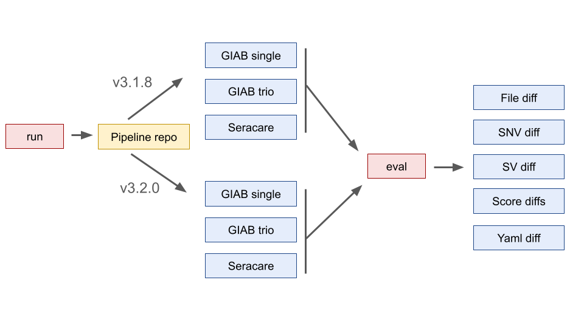

### Outline

The intent with PipeEval is to make more in-depths evaluation of results between pipeline changes easier and faster to carry out.



### Requirements

Written to be compatible with version 3.6 (the version running on our cluster).

Only standard libs are currently used.

### Running the Runner

```{python}
python3 main.py run \
    --checkout jw_update_genmod \
    --baseout out/genmod \
    --config default.config \
    --run_type giab_single \
    --start_data bam \
    --repo /path/to/repo \
    --label run1
```

```{python}
usage: main.py run [-h] [--label LABEL] --checkout CHECKOUT --baseout BASEOUT
                   --repo REPO [--start_data START_DATA] --run_type RUN_TYPE
                   [--dry] [--skip_confirmation] [--stub] --config CONFIG
                   [--queue QUEUE] [--nostart]

Runs a pipeline.

optional arguments:
  -h, --help            show this help message and exit
  --label LABEL         Something for you to use to remember the run
  --checkout CHECKOUT   Tag, commit or branch to check out in --repo
  --baseout BASEOUT     The base folder into which results folders are created
                        following the pattern:
                        {base}/{label}_{run_type}_{checkout})
  --repo REPO           Path to the Git repository of the pipeline
  --start_data START_DATA
                        Start run from FASTQ (fq), BAM (bam) or VCF (vcf)
                        (must be present in config)
  --run_type RUN_TYPE   Select run type from the config (i.e. giab-single,
                        giab-trio, seracare ...). Multiple comma-separated can
                        be specified.
  --dry, -n             Go through the motions, but don't execute the pipeline
  --skip_confirmation   If not set, you will be asked before starting the
                        pipeline run
  --stub                Pass the -stub-run flag to the pipeline
  --config CONFIG       Config file in INI format containing information about
                        run types and cases
  --queue QUEUE         Optionally specify in which queue to run (i.e. low,
                        grace-normal etc.)
  --nostart             Run start_nextflow_analysis.pl with nostart, printing
                        the path to the SLURM job only
```

### Running the evaluator

```{python}
python3 main.py eval \
    --results1 /path/results1 \
    --results2 /path/results2 \
    --config runner/default.config \
    --outdir /path/eval_out \
    --comparisons default
```

```{python}
usage: main.py eval [-h] [--run_id1 RUN_ID1] [--run_id2 RUN_ID2] --results1
                    RESULTS1 --results2 RESULTS2 --config CONFIG
                    [--comparisons COMPARISONS]
                    [--score_threshold SCORE_THRESHOLD]
                    [--max_display MAX_DISPLAY] [--outdir OUTDIR]

Takes two sets of results and generates a comparison

optional arguments:
  -h, --help            show this help message and exit
  --run_id1 RUN_ID1, -i1 RUN_ID1
                        The group ID is used in some file names and can differ
                        between runs. If not provided, it is set to the base
                        folder name.
  --run_id2 RUN_ID2, -i2 RUN_ID2
                        See --run_id1 help
  --results1 RESULTS1, -r1 RESULTS1
  --results2 RESULTS2, -r2 RESULTS2
  --config CONFIG       Additional configurations
  --comparisons COMPARISONS
                        Comma separated. Defaults to: default, run all by:
                        file,vcf,score,score_sv,yaml
  --score_threshold SCORE_THRESHOLD
                        Limit score comparisons to above this threshold
  --max_display MAX_DISPLAY
                        Max number of top variants to print to STDOUT
  --outdir OUTDIR       Optional output folder to store result files
```